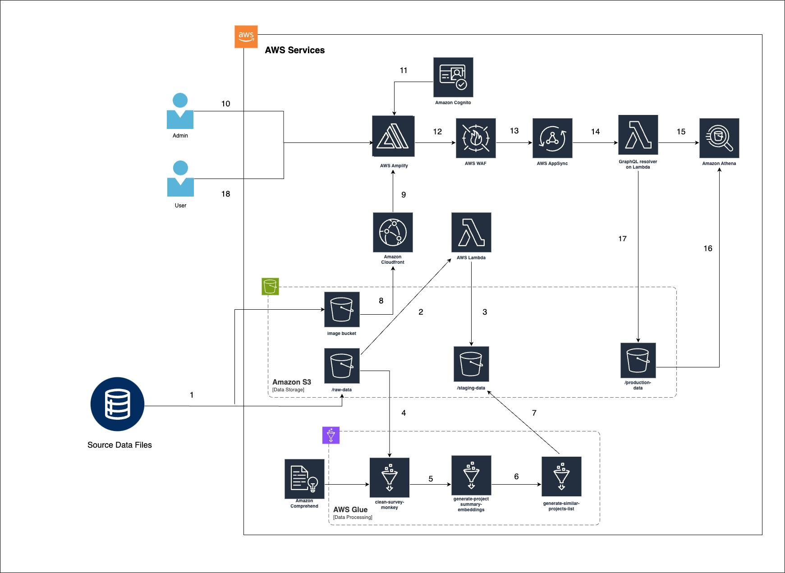

# TLEF Analytics

The TLEF (Teaching and Learning Enhancement Fund) Analytics prototype solutions aims to increase the visibility and accessibility of the TLEF portfolio. The prototype leverages AWS technology to move data storage to the cloud and simplify data cleaning processes, and innovates on the structure and presentation of data with advanced filtering and dynamic views. For more information visit the [CIC website](https://cic.ubc.ca/project/student-advising-assistant/).

| Index | Description |
| ----- | ----------- |
| [High Level Architecture](#high-level-architecture) | High level overview illustrating component interactions |
| [Deployment](#deployment) | How to deploy the project |
| [User Guide](#user-guide) | The working solution |
| [Development](#development) | Information about the application's development |
| [Directories](#directories) | Project's general directory structure |
| [Changelog](#changelog) | Any changes post publish |
| [Credits](#credits) | Meet the team behind the solution |
| [License](#license) | License details |

## High Level Architecture
The following architecture diagram illustrates the various AWS components utilized to deliver the solution. For an in-depth explanation of the frontend and backend stacks, refer to the [Architecture Design](./docs/ArchitectureDesign.md).


## Deployment
For instructions on how to deploy the application, refer to the [Deployment Guide](./docs/DeploymentGuide.md).

## User Guide
For instructions on how interact with the application via Alexa, refer to the [User Guide](./docs/UserGuide.md).

## Development
For information on how the application was developed, refer to the [Development Document](./docs/DevelopmentDocument.md).

## Directories
```
├── README.md
├── backend
│   └── cdk
│       ├── amplify
│       ├── bin
│       ├── bucket_config
│       ├── bucket_config_img
│       ├── glue
│       ├── graphql
│       ├── lambda
│       ├── lib
├── docs
└── frontend
    └── src
        ├── App.jsx
        ├── components
        │   ├── charts
        │   ├── home
        │   ├── snapshot
        │   ├── summary
        │   └── util
        ├── constants
        ├── pages
```
1. `/backend/cdk`: Contains the deployment code for the app's AWS infrastructure
    - `/amplify`: Contains the configuration file needed for building Amplify app.
    - `/bucket_config`: Contains the directory structure that will be uploaded to S3.
    - `/bucket_config_img`: Contains the directory structure of the image bucket that will be uploaded to S3.
    - `/glue`: Contains the database schema file.
    - `/graphql`: Contains the GraphQL data schema file and request/response mapping template files.
    - `lambda`: Contains the scripts for all lambda functions.
    - `/lib`: Contains the deployment code for all 3 stacks of the infrastructure
2. `/docs`: Contains all the documents.
3. `/frontend`: Contains the user interface code for the solution.
    - `/src/components`: Contains all components
        - `/charts`: Classes used for rendering charts/graphs
        - `/home`: Components used for home page
        - `/snapshot`: Components used for project summary page
        - `/summary`: Components used for individual summary page
    - `/constants`: Contains all constants
    - `/pages`: Contains user interface code for home page, project summary page, and individual summary page.


## Changelog
N/A

## Credits
This application was architected and developed by Kotaro Ito, Harshinee Sriram, Aurora Cheng, and Tien Nguyen, with project assistance by Franklin Ma. A special thanks to the UBC Cloud Innovation Centre Technical and Project Management teams for their guidance and support.

## License
This project is distributed under the [MIT License](./LICENSE).

[Apache 2.0](https://www.apache.org/licenses/LICENSE-2.0)
- Used by `aws-cdk` to handle AWS services

