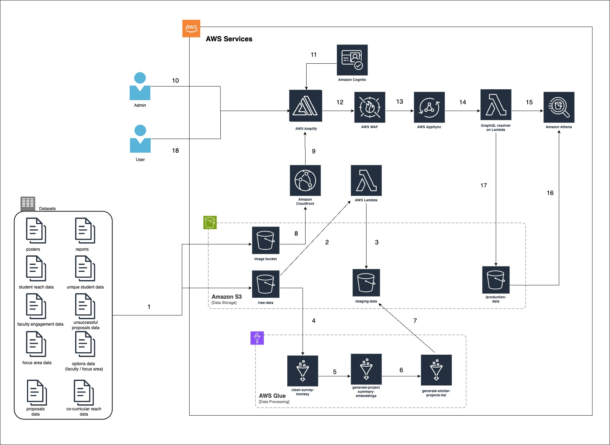

# Architecture Design
This document provides a more in-depth explanation of the system's architecture and operation.

## Table of Contents
- Architecture Design
    - Table Of Contents
- Introduction
- System Overview
    - Data Preparation
    - Data Retrieval
    - Data Consumption
- AWS Infrastructure
    - Architecture Diagram

## Architecture

## Data Preparation(1-7)

1. Administrators upload files (datasets, posters, reports) to appropriate locations in Amazon S3.\
    For specific location in the storage to which each datasets are uploaded, refer to [our data lake schema]().
2. Datasets other than raw Survey Monkey data will be automatically converted from excel format to parquet format and be ready for consumption.
3. Converted datasets will be transferred to `/staging` folder, where all staged datasets are stored.
4. Survey Monkey Data will be taken by the first Glue job, and go through the cleaning process. As a result of this process, two new files `project_details` and `faculty_engagement` will be generated. For detailed explanation of this cleaning process, please refer to [this document]().
5. Generated files `project_details` and `faculty_engagement` will then be reviewed/edited by administrators. Once the reviewing process is finished, `faculty_engagement` file will be converted to parquet and transferred to `/staging` folder. `project_details`, on the other hand, requires additional operations. The file will be passed in to the second Glue job to generate new IDs in case some records in the dataset do not have them. After the process, a file named `project_details_with_new_ids` will be generated and stored in `/staging` folder in parquet format. For detailed explanation, please visit [this document]().
6. The product of the previous step will be reused in the third Glue job, where similarity scores between all projects will be computed and stored. At the end of the job, it generates `similar_projects` file, which maps all projects and their similar projects. For more information, please visit [this document]().
7. `similar_projects` file will then be stored in `/staging` folder.

## Previewing Staged Data(8-17)
The existence of `/staging` folder allows administrators to preview staged data and detect any errors before it's published.

8. Uploaded images will be accessed via AWS CloudFront. 

After datasets are cleaned and stored in the appropriate location, the solution uses Amazon Athena to perform data retrieval. Amazon Athena is an interactive query service that makes it easy to analyze data directly in Amazon S3 using standard SQL. Athena utilizes the table schemas defined in AWS Glue, and query directly from datasets stored in Amazon S3.

## Data Consumption
### Website hosted by AWS Amplify