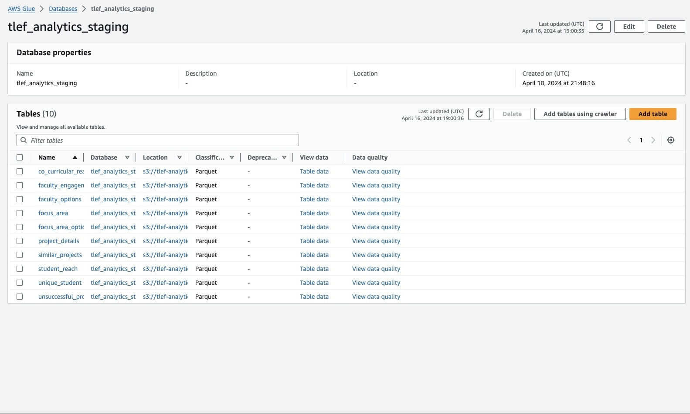
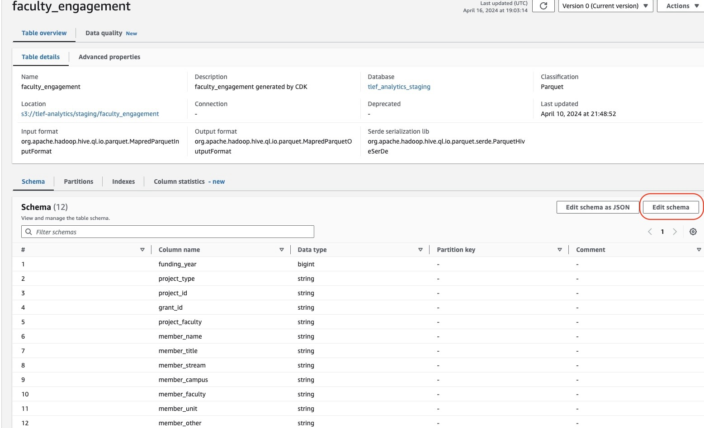
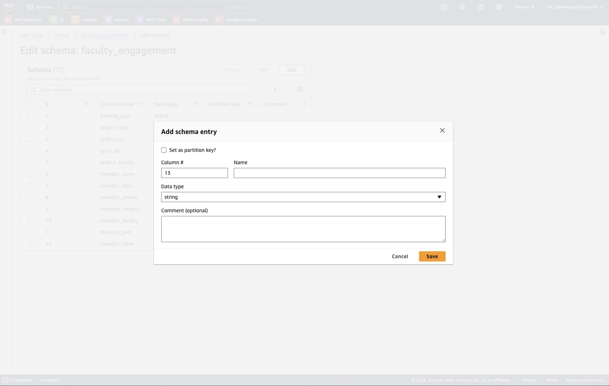
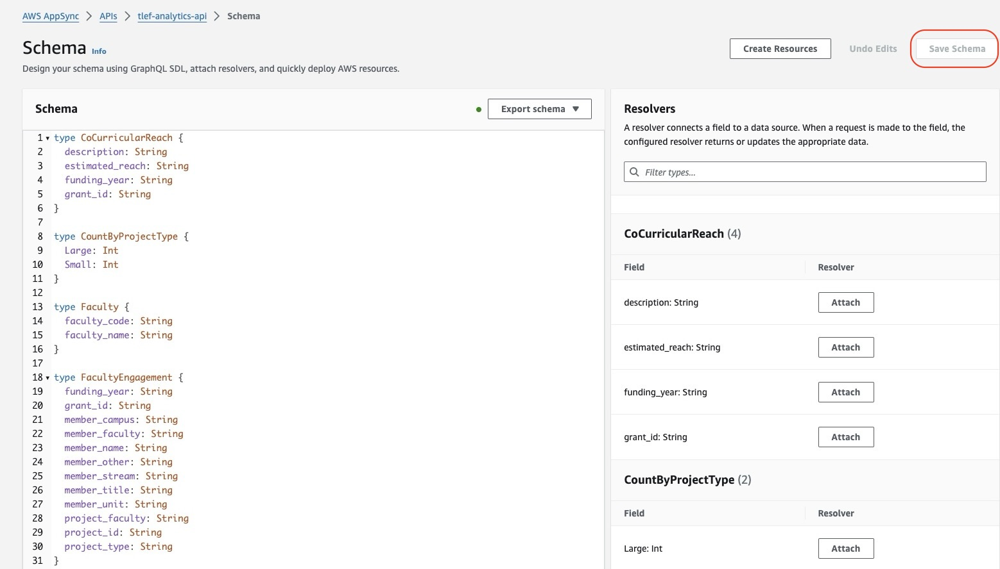

# How to Add New Columns to the Existing Datasets

## Table of Contents
- Step 0: Add a New Column
- Step 1: Upload New Datasets
- Step 2: Modify Table Schema on AWS Glue
- Step 3: Update GraphQL Schema on AWS AppSync

## Step 0: Add a New Column
When you want to update the existing datasets by adding new columns, you can simply add them to the end of each datasets (insert them to the **right** of the table). Make sure you insert them to the right, as not following this practice could result in breaking the existing table structures.

## Step 1: Upload New Datasets
The next step would be uploading new datasets to the appropriate location in Amazon S3 bucket.
Always upload new excel datasets (`~.xlsx`) to the `/raw` folder. This will ensure that all uploaded files will be converted to the appropriate format and be ready for consumption. 

ex. When you add a new column to the `faculty engagement` datasets, you will need to upload a new file to `/raw/faculty_engagement` folder.

## Step 2: Modify Table Schema on AWS Glue
In this step, you will update the table Schema defined in AWS Glue Data Catalog. 

First, navigate to AWS Glue console. From the left side bar, select `Databases`, then select `tlef_analytics_staging` database from the listed options.



Click the name of the table of which you would like to update the schama.



Click `Edit Schema` button, then click `Add`.



In this menu, you will need to enter the following information:
- **Column #**: AWS Glue automatically fill in this section, and you do not need to modify it.
- **Name**: The name of the column you added to the table. Make sure the name matches the actual column name.
- **Data type**: Select the appropriate data type. For more information, visit [AWS Glue official documentation on common data types](https://docs.aws.amazon.com/databrew/latest/dg/datatypes.html).

After you enter these sections, click `Save`, then click `Save as new table version`.

## Step 3: Update GraphQL Schema on AWS AppSync
Lastly, go to AWS AppSync console and update GraphQL schema.
From `APIs` list, select the API named `tlef-analytics-api`.
Then select `Schema` menu from the left side bar.



From the displayed schema, find the appropriate `type` that corresponds to the table you updated in the previous step.

ex. If you updated `faculty_engagment` table, you will find that there is a `type` named `FacultyEngagement`. 

When you find the `type`, update it by adding a new line to the end of the `type` declaration.

ex. `FacultyEngagement` type currently looks like the code attached below.
```
type FacultyEngagement {
	funding_year: String
	grant_id: String
	member_campus: String
	member_faculty: String
	member_name: String
	member_other: String
	member_stream: String
	member_title: String
	member_unit: String
	project_faculty: String
	project_id: String
	project_type: String
}
```
You can update the schema by adding `<COLUMN-NAME>: <COLUMN-DATA-TYPE>` to the end.
After the insertion, `FacultyEngagement` type would look like the code below.

```
type FacultyEngagement {
	funding_year: String
	grant_id: String
	member_campus: String
	member_faculty: String
	member_name: String
	member_other: String
	member_stream: String
	member_title: String
	member_unit: String
	project_faculty: String
	project_id: String
	project_type: String
    <COLUMN-NAME>: <COLUMN-DATA-TYPE>
}
```
Make sure you replace `<COLUMN-NAME>` and `<COLUMN-DATA-TYPE>` with the name and data type of the newly added column.

**Once you finish updating GraphQL Schema, Click `Save Schema` at the top right corner.**
*Note: AppSync's data types are slightly different from AWS Glue. Visit [this document](https://docs.aws.amazon.com/appsync/latest/devguide/scalars.html) for reference, and find the matching data type.*