# How to Upload Data

## Table of Contents
- [Introduction](#introduction)
- [Project Details and Faculty Engagement](#project-details-and-faculty-engagement)
    - [Step 1: Name Datasets Appropriately](#step-1-name-datasets-appropriately)
    - [Step 2: Upload Raw Data File](#step-2-upload-raw-data-file)
    - [Step 3: Initiate Glue Job](#step-3-initiate-glue-job)
        - [Step 3-1: Copy S3 URI](#step-3-1-copy-s3-uri)
        - [Step 3-2: Update Glue Job Parameter](#step-3-2-update-glue-job-parameter)
    - [Step 4: Complete Pre-Populated Datasets](#step-4-complete-pre-populated-datasets)
    - [Step 5: Re-Upload Datasets](#step-5-re-upload-datasets)
    - [Step 6: Start the Second Glue Job](#step-6-start-the-second-glue-job)
        - [Step 6-1: Copy S3 URI](#step-6-1-copy-s3-uri)
        - [Step 6-2: Update Glue Job Parameter](#step-6-2-update-glue-job-parameter)
    - [Step 7: Edit Data](#step-7-edit-data) 
- [Other Datasets](#other-datasets)
    - [Step 1: Name Datasets Appropriately](#step-1-name-datasets-appropriately-1)
    - [Step 2: Uploading files](#step-2-uploading-files)
    - [Step 3: Editing Datasets](#step-3-editing-datasets)
        - [Step 3-1: Downloading File onto Local Computer](#step-3-1-downloading-file-onto-local-computer)
        - [Step 3-2: Re-Uploading Datasets](#step-3-2-re-uploading-datasets)
- [Posters and Reports](#posters-and-reports)
    - [Step 1: Name Posters and Reports Appropriately](#step-1-name-posters-and-reports-appropriately)
    - [Step 2: Upload Posters and Reports](#step-2-upload-posters-and-reports)

# Introduction
The procedure of uploading the datasets differs depending on the dataset.\
Most datasets can be uploaded in a simple way, whereas uploading `project_details` and `faculty_engagement` datasets requires a few more additional steps.

# Project Details and Faculty Engagement
`project_details` and `faculty_engagement` datasets will be pre-populated by our data cleaning process of raw Survey Monkey data. You can then populate the generated files by filling in empty columns, then re-upload them to make them viewable from the web application.

## Step 1: Name Datasets Appropriately
When you upload datasets, make sure the file name follows our naming convention.\
Raw survey monkey data file should be named `survey_monkey_{year}.xlsx`, where `{year}` is replaced by the current funding year.

ex. When you upload raw survey monkey data file for the year 2030, it should be named `survey_monkey_2030.xlsx`.

## Step 2: Upload Raw Data File
Firstly, you need to upload the raw survey monkey file to `/raw/survey_monkey` folder within `tlef-analytics` bucket.\
Click `Upload` to upload the file.

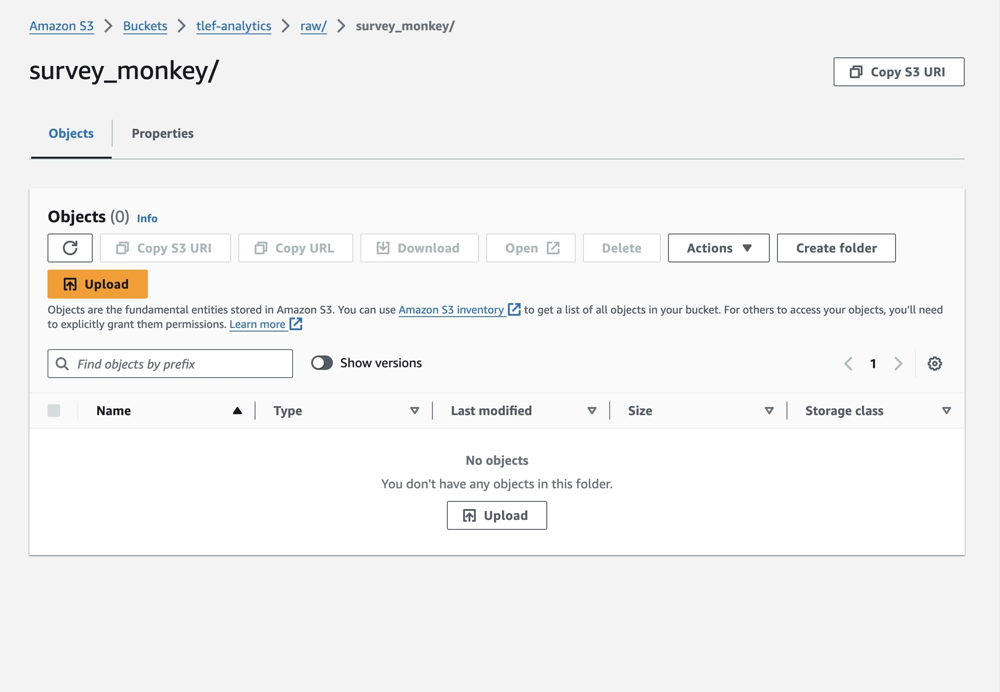

You can either drag and drop the file, or choose `Add files` to upload it.\
Click `Upload` at the bottom right corner to complete the process.

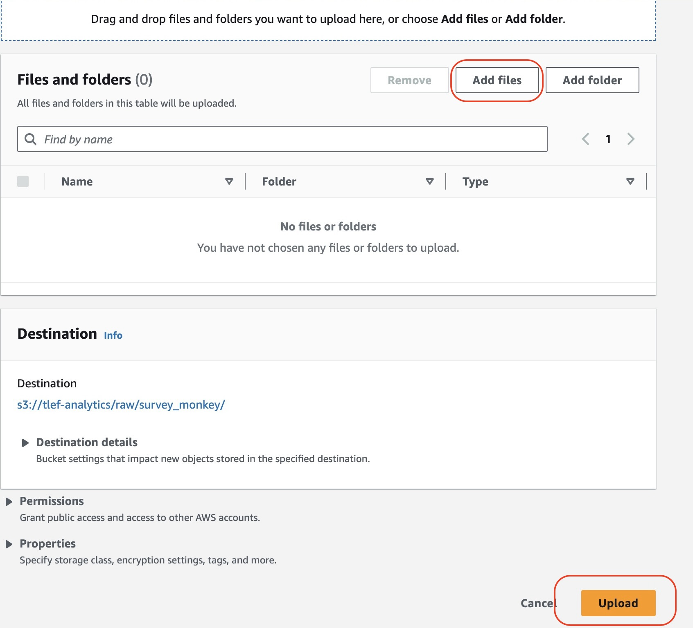

## Step 3: Initiate Glue Job
### Step 3-1: Copy S3 URI
To initiate the data cleaning process of raw survey monkey data file you uploaded in [step 2](#step-2-upload-raw-data-files), you will first copy the S3 URI of the uploaded file.

Go to `tlef-analytcs/raw/survey_monkey` folder and click on the item you uploaded. \
From the top menu, press `Copy S3 URI`.
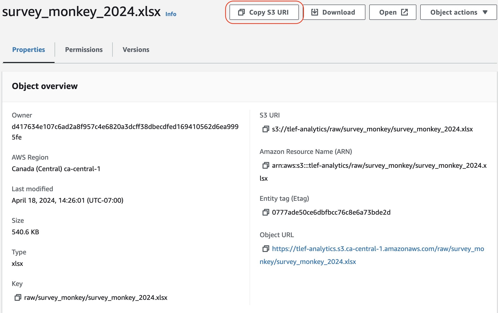.

### Step 3-2: Update Glue Job Parameter
Next, navigate to AWS Glue console.
You can do so by typing `Glue` on the top search bar.
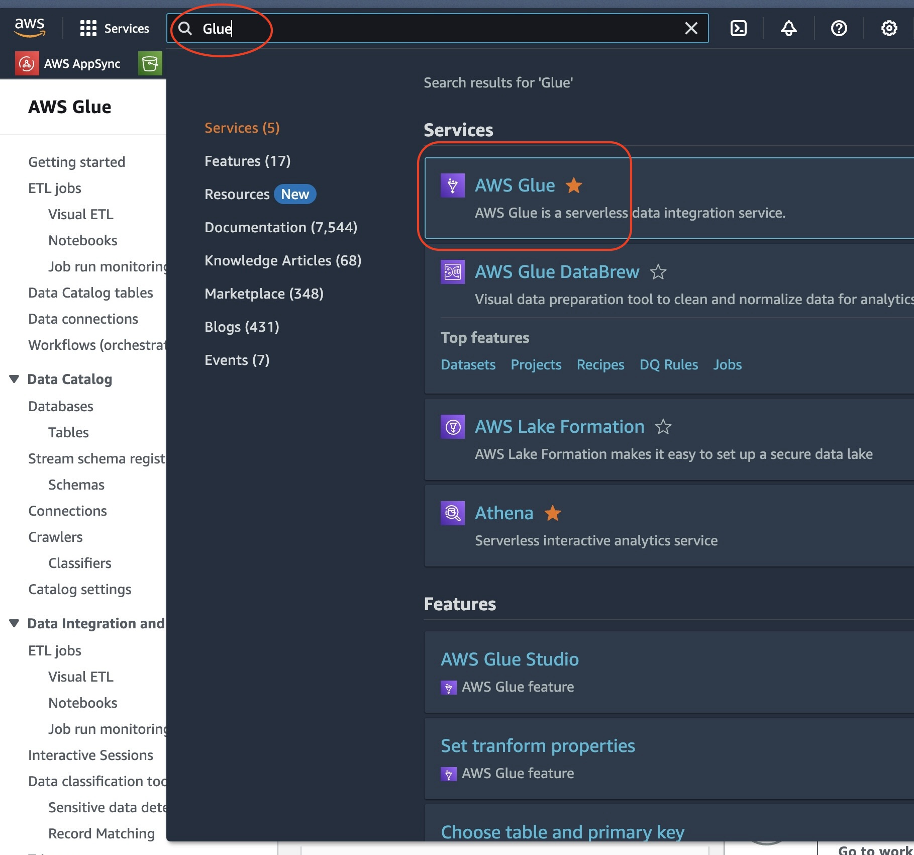

From the left side bar, select `ETL jobs`. This will direct you to the `Your jobs` section.\
From the list of jobs, select `tlef-clean-survey-monkey-data`.\
Select `Job details` tab, then click `Advanced Properties` at the bottom.

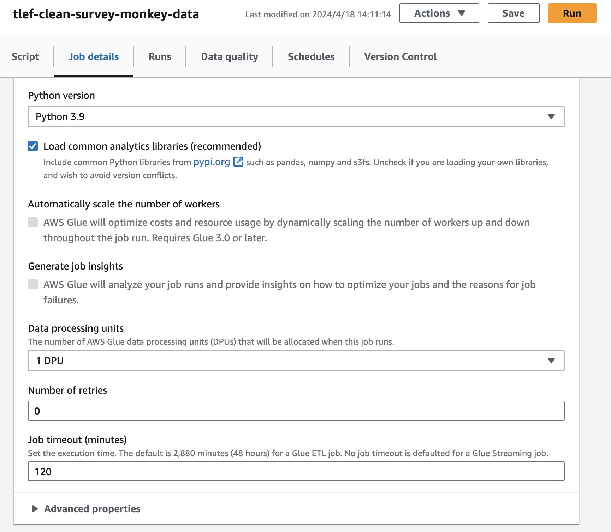

When you scroll down, you will see a section `Job parameters`.\
Replace the `Value` of one of the parameters `--SURVEY_MONKEY_S3URI`. After the fresh deployment, the value is `n/a`. Replace it with the S3 URI of the file that you copied in the [previous step](#step-3-1-copy-s3-uri).

After you update the parameter, click `Save` at the top-right corner, then press `Run` to start the job.

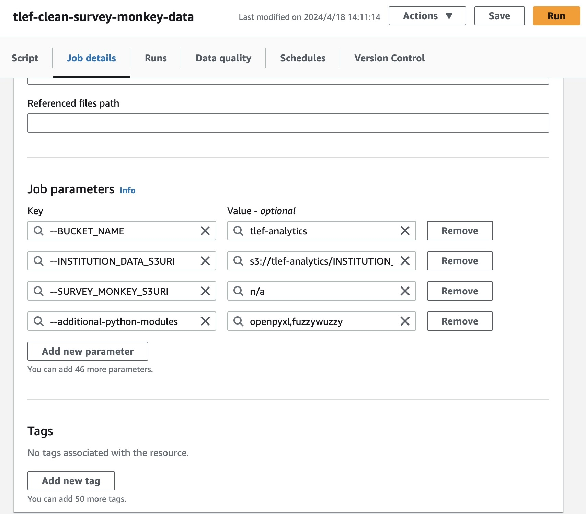

## Step 4: Complete Pre-Populated Datasets
After our first Glue job is completed, you will see two files generated as a result of our data cleaning process.\
`/raw/project_details` folder contains a new dataset named `project_details_{year}.xlsx` and `/raw/faculty_engagement` contains `faculty_engagement_{year}.xlsx`, where `{year}` represents the funding year of the dataset you uploaded earlier.

These datasets are formatted and cleaned, but miss a few columns which should be manually completed by the user. To make changes to the dataset, you first need to download the datasets onto your local computer.

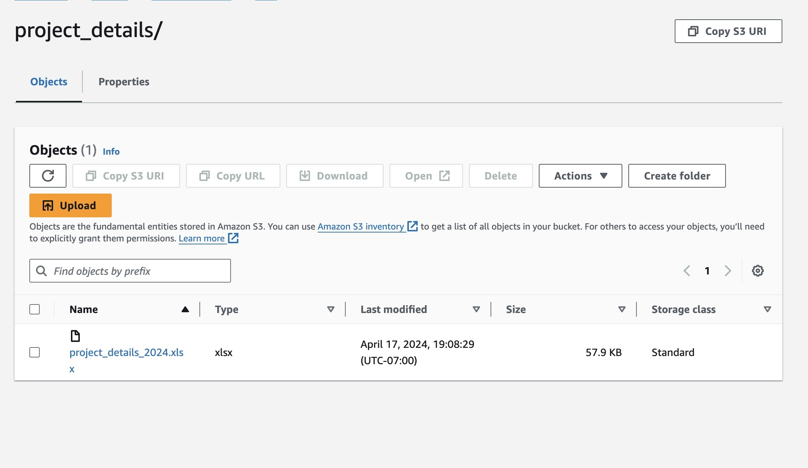

Click on the item you would like to download, then click `Download` from the top menu to download the file onto your local computer.

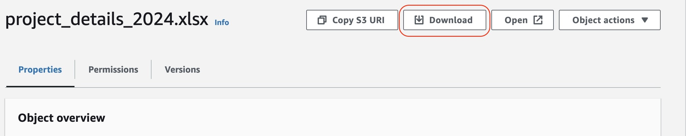

## Step 5: Re-Upload Datasets
Once you finish editing the pre-generated datasets, you will need to re-upload the complete datasets back to Amazon S3 at the appropriate locations.

Before you upload the files, make sure the file names are the same as what you uploaded eariler in [step 2](#step-2-upload-raw-data-files).\
Specifically, remove any number that has been added to the end of the file name, if there is any.\
ex. If your downloaded file is named like `project_details(1).xlsx`, remove `(1)` from the file name and re-upload it.

For `project_details_{year}.xlsx`, upload the files to `/raw/project_details` folder.\
`faculty_engagement_{year}.xlsx` files need to be uploaded to `/raw/faculty_engagement` folder.

## Step 6: Start the Second Glue Job
### Step 6-1: Copy S3 URI
`faculty_engagement_{year}.xlsx` will be automatically converted and copied to `/staging/faculty_engagement` folder. 

`project_details_{year}.xlsx` will require an additional step to complee the data preparation process. \
Navigate to the file location in S3, then click `Copy S3 URI`.
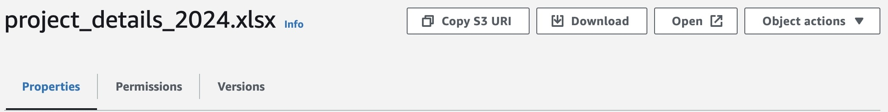

### Step 6-2: Update Glue Job Parameter
Again, navigate to AWS Glue console. If you are unsure of how to go to the console, please refer to [step 3-2](#step-3-2-update-glue-job-parameter).

Select `ETL jobs` from the left sidebar, then click `tlef-generate-new-grant-ids`.\
Select Job details tab, then click `Advanced Properties` at the bottom.

When you scroll down, you will see a section called `Job parameters`.
Replace the `Value` of one of the parameters `--PROJECT_DETAILS_S3URI`. 

After that, click `Save`, then `Run` to start the Glue job.

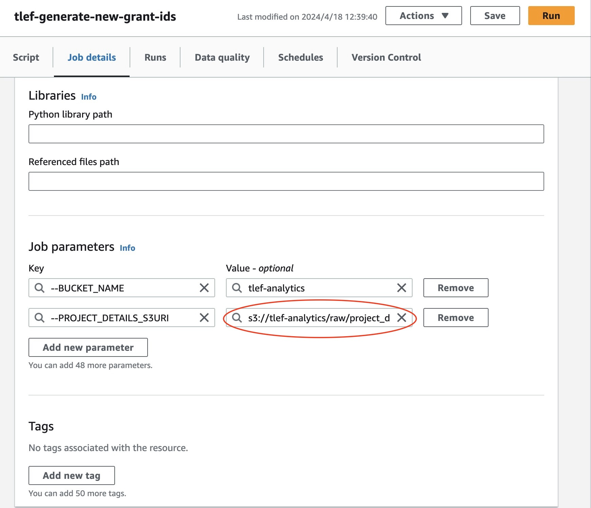

## Step 7: Edit Data
If you would like to edit data after [step 6](#step-6-start-the-second-glue-job), you can repeat [step 4 and 5](#step-4-complete-pre-populated-datasets) for changes to take place. 

# Other Datasets
## Step 1: Name Datasets Appropriately
When you upload datasets, make sure the file name follows our naming convention. Please check the table below for the details.

| Data Yype | Naming Convention | Example |
| --------- | ----------------- | ------- |
| Focus Area | `focus_area_{year}.xlsx` | `focus_area_2024.xlsx`|
| Faculty Options | `options_faculty.xlsx` | `options_faculty.xlsx` |
| Focus Area Options | `options_focus_area.xlsx` | `options_focus_area.xlsx` |
| Student Reach | `student_reach_{year}.xlsx` | `student_reach_2024.xlsx` |
| Unique Student | `unique_student_{year}.xlsx` | `unique_student_2024.xlsx` |
| Unsuccessful Projects | `unsuccessful_projects_{year}.xlsx` | `unsuccessful_projects_2024.xlsx` |

## Step 2: Uploading files
Once you name each file correctly, upload the files to the appropriate location in Amazon S3. Please refer to the table below for details.

| Data Type | Location |
| --------- | -------- |
| Focus Area | `/raw/focus_area/` |
| Faculty Options | `/raw/options/faculties/` |
| Focus Area Options | `/raw/options/focus_area/` | 
| Student Reach | `/raw/student_reach/` |
| Unique Student | `/raw/unique_student/` | 
| Unsuccessful Projects | `/raw/unsuccessful_projects/` |

Navigate to your folder, and click `Upload`.
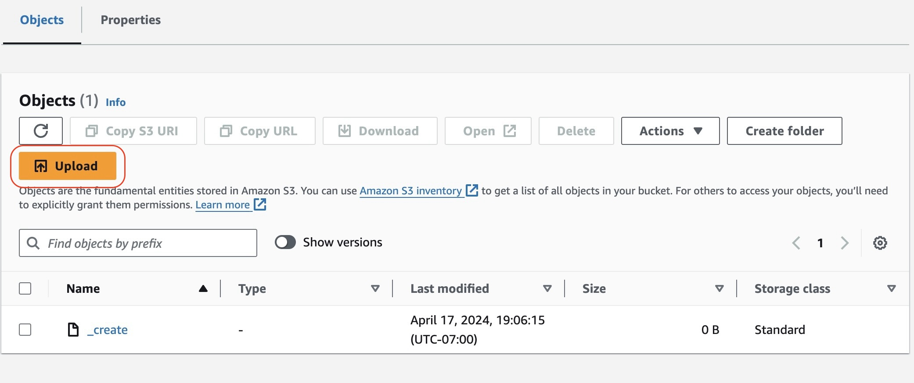

You can either drag and drop the file, or choose `Add files` to upload it.\
Click `Upload` at the bottom right corner to complete the process.

After you upload each file to the correct location in the S3 bucket, the data preparation process will automatically be triggered and the files will be stored into `/staging/` folder.

You can then preview the data you uploaded from the web application.

## Step 3: Editing Datasets
If you would like to edit the contents of the datasets after the initial uploads, you can follow the procedures described below.

### Step 3.1: Downloading File onto Local Computer
Select the checkbox next to the item you would like to make changes to, then click `Download` from the top menu. This will allow you to download the file onto your computer. You can then edit the file in Microsoft Excel.

### Step 3-2: Re-Uploading Datasets
Before you re-upload, make sure the file names are the same as what you uploaded earlier in [step 2](#step-2-uploading-files).

Go to Amazon S3 console, and upload files by repeating [step 2](#step-2-uploading-files).

# Posters and Reports
## Step 1: Name Posters and Reports Appropriately

When you upload datasets, make sure the file name follows our naming convention. Please check the table below for the details.

| Data Type | Naming Convention | Example |
| --------- | ----------------- | ------- |
| Poster | `<grant id>-Poster.png` | `2030-TLEF-SP1-SCI-Evans-Poster.png` |
| Report | `<project id>-Report.png` | `2030-SP-SCI-001.png` |

## Step 2: Upload Posters and Reports
Once you name each file correctly, upload the files to the appropriate location in a S3 bucket named `tlef-analytics-image`. Please refer to the table below for details.

| Data Type | Location |
| --------- | -------- |
| Poster | `tlef-analytics-image/poster/` |
| Report | `tlef-anaytics-image/report/` |

Navigate to your folder, and click `Upload`.

You can either drag and drop the file, or choose `Add files` to upload it.\
Click `Upload` at the bottom right corner to complete the process.

